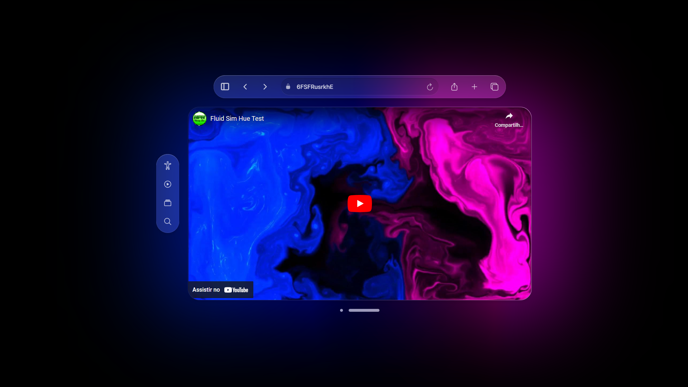

# Player VR

A YouTube video player with ambient light.

## Technologies used

- [ionicons](https://ionic.io/ionicons)
- [Akar Icons](https://akaricons.com/)
- [YouTube Player API](https://developers.google.com/youtube/iframe_api_reference)

## Preview

## License

This project is licensed under the [MIT license](LICENSE).
